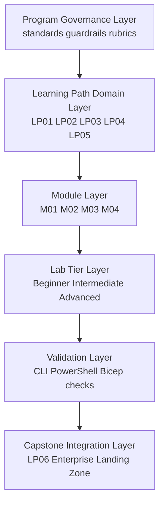
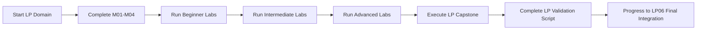

# Overall Lab Program Architecture Model

## Purpose
This document describes the end-to-end architecture model for the AZ-104 enterprise lab program across LP01-LP06.

## Architecture Principles
- Command-first delivery with portal parity where required.
- Progressive skill layering from foundations to capstone integration.
- Evidence-driven validation for every module and lab tier.
- Least privilege, repeatability, and rollback-safe operations.

## Program Architecture Layers

## Domain-to-Path Model
| Domain | Learning Path | Core Outcome | Typical Evidence |
|---|---|---|---|
| Identity and governance | LP01 | Secure scope, policy, and access controls | RBAC and policy validation output |
| Storage management | LP02 | Durable and secure data platform operations | Storage config and protection evidence |
| Compute resources | LP03 | Reliable workload hosting and operations | VM and app operations evidence |
| Virtual networks | LP04 | Segmented and controlled connectivity | Route, NSG, and connectivity tests |
| Monitoring and backup | LP05 | Observability and recovery readiness | Alert, log, and restore evidence |
| Final capstone | LP06 | Integrated enterprise landing zone operations | End-to-end architecture and validation artifacts |

## Delivery Flow

## Cross-LP Integration Model
- LP01 contributes identity, scope, and governance controls.
- LP02 contributes storage durability, protection, and access constraints.
- LP03 contributes compute sizing, resilience, and operational controls.
- LP04 contributes routing, segmentation, and connectivity enforcement.
- LP05 contributes telemetry, incident response, and backup assurance.
- LP06 combines all prior domains into one validated enterprise operating model.

## LP06 Final Architecture Alignment
LP06 validates the integrated enterprise landing-zone topology:
- Hub and spoke virtual networking model.
- VPN gateway in hub for hybrid-ready control-plane pattern.
- Marketplace NVA deployment with OPNsense in hub.
- Forced tunneling from spokes through hub inspection path.
- Positive and negative connectivity validation from spoke workloads.

## Validation and Quality Gates
- Every module provides objective validation artifacts.
- Every lab tier requires reproducible command evidence.
- Every capstone requires architecture rationale and rollback notes.
- Program-wide quality is enforced by rubrics and standards in docs/program.

## Related Documents
- [Curriculum Matrix](../program/curriculum-matrix.md)
- [Standards and Guardrails](../program/standards-and-guardrails.md)
- [Cohort Guide](../program/cohort-guide.md)
