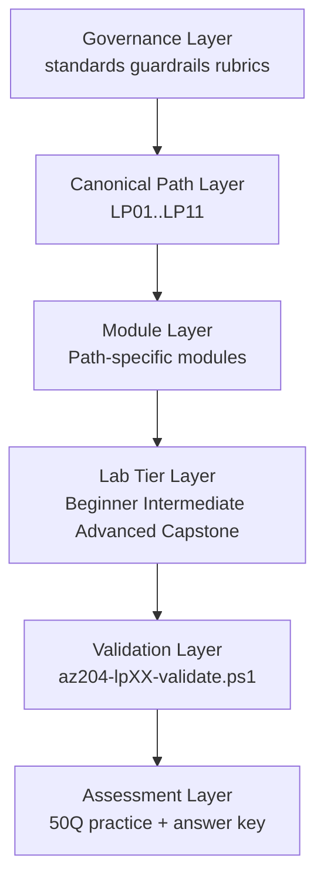
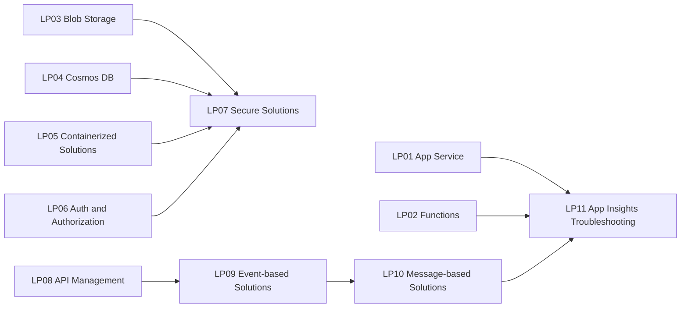

# Overall Lab Program Architecture Model

## Purpose
Describe the canonical AZ-204 architecture for modular learning-path delivery.

## Architecture Principles
- Developer-first and exam-aligned
- Fine-grained path decomposition mirroring AZ-204 skill areas
- Validation-first learning evidence
- Reusable templates and shared automation

## Program Architecture Layers

```mermaid
flowchart TB
    A[Governance Layer\nstandards guardrails rubrics] --> B[Canonical Path Layer\nLP01..LP11]
    B --> C[Module Layer\nPath-specific modules]
    C --> D[Lab Tier Layer\nBeginner Intermediate Advanced Capstone]
    D --> E[Validation Layer\naz204-lpXX-validate.ps1]
    E --> F[Assessment Layer\n50Q practice + answer key]
```

## Canonical Path Topology

```mermaid
flowchart LR
    LP01[LP01 App Service] --> LP11[LP11 App Insights Troubleshooting]
    LP02[LP02 Functions] --> LP11
    LP03[LP03 Blob Storage] --> LP07[LP07 Secure Solutions]
    LP04[LP04 Cosmos DB] --> LP07
    LP05[LP05 Containerized Solutions] --> LP07
    LP06[LP06 Auth and Authorization] --> LP07
    LP08[LP08 API Management] --> LP09[LP09 Event-based Solutions]
    LP09 --> LP10[LP10 Message-based Solutions]
    LP10 --> LP11
```

## Delivery Model
- Each learning path is independently teachable.
- Paths can be sequenced by cohort needs and exam readiness.
- Shared validation/assessment format remains consistent across paths.

## Related Documents
- `docs/program/az204-taxonomy.md`
- `docs/program/curriculum-matrix.md`
- `docs/program/curriculum-alignment.md`
