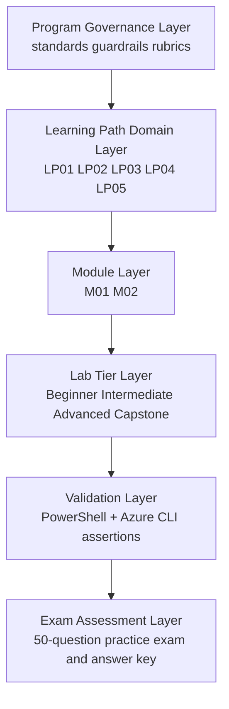
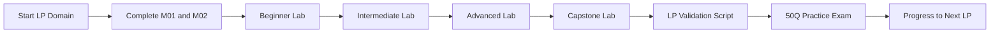

# Overall Lab Program Architecture Model

## Purpose
This document describes the end-to-end architecture model for the AZ-204 enterprise lab program across LP01–LP05.

## Architecture Principles
- SDK-first delivery with CLI parity where required.
- Progressive skill layering from foundations through security and integration.
- Evidence-driven validation for every module and lab tier.
- Least privilege, credential-free patterns, and rollback-safe operations.

## Program Architecture Layers

```mermaid
flowchart TB
    A[Program Governance Layer\nstandards guardrails rubrics] --> B[Learning Path Domain Layer\nLP01 LP02 LP03 LP04 LP05]
    B --> C[Module Layer\nM01 M02]
    C --> D[Lab Tier Layer\nBeginner Intermediate Advanced Capstone]
    D --> E[Validation Layer\nPowerShell + Azure CLI assertions]
    E --> F[Exam Assessment Layer\n50-question practice exam and answer key]
```

## Domain-to-Path Model

| Domain | Learning Path | Core Outcome | Typical Evidence |
|--------|--------------|--------------|-----------------|
| Develop Azure compute solutions | LP01 | Deploy and operate App Service + Azure Functions | Deployment slot swap, function trigger output |
| Develop for Azure storage | LP02 | Operate Blob Storage and Cosmos DB via SDK | SDK operation output, Cosmos DB query evidence |
| Implement Azure security | LP03 | Credential-free apps using Key Vault and managed identity | Validation script PASS output, secret retrieval log |
| Monitor, troubleshoot, and optimize | LP04 | Instrument apps with App Insights; tune with caching | Telemetry dashboard, cache hit evidence |
| Connect to and consume services | LP05 | Integrate apps with API Management, Service Bus, Event Grid | API call evidence, message flow trace |

## Delivery Flow

```mermaid
flowchart LR
    S1[Start LP Domain] --> S2[Complete M01 and M02]
    S2 --> S3[Beginner Lab]
    S3 --> S4[Intermediate Lab]
    S4 --> S5[Advanced Lab]
    S5 --> S6[Capstone Lab]
    S6 --> S7[LP Validation Script]
    S7 --> S8[50Q Practice Exam]
    S8 --> S9[Progress to Next LP]
```

## Cross-LP Integration Model

- LP01 establishes compute hosting patterns and serverless event-driven architecture.
- LP02 introduces data persistence using SDK-level Blob and Cosmos DB operations.
- LP03 overlays security: Key Vault, managed identity, and credential-free patterns used in LP01/LP02.
- LP04 adds observability and performance optimization across all LP01–LP03 workloads.
- LP05 introduces messaging, eventing, and API management to compose the full developer architecture.

## Lab Tier Model

| Tier | Duration | Objective | Autonomy |
|------|----------|-----------|----------|
| Beginner | ~45–60 min | Guided step-by-step; one core concept | Low — full command blocks provided |
| Intermediate | ~60–90 min | Apply concept in a realistic scenario | Medium — partial guidance |
| Advanced | ~90–120 min | Integrate multiple services; minimal scaffolding | High — objectives only |
| Capstone | ~120–180 min | End-to-end production-readiness scenario | Full — student-driven |

## Masterclass Model

Each LP includes at least one masterclass track (CLI or SDK). Masterclasses are:
- 90–120 minutes of instructor-led deep-dive
- Live demo + workshop combination
- Aligned to the AZ-204 exam skills measured in the domain

## Validation Model

Each LP has a PowerShell validation script under `validation/`:
- Checks Azure resource existence and configuration
- Asserts security settings (RBAC auth, purge protection, soft-delete, etc.)
- Exits with `[RESULT] PASS` or `[RESULT] FAIL` and a pass/fail count
- Designed to be re-run safely (idempotent checks only)

## Assessment Model

Each LP includes a 50-question practice exam and answer key under `exams/`:
- Questions aligned to AZ-204 exam skill areas for the domain
- Answer key includes topic mapping, scoring bands, and instructor notes
- Target passing score: 70% (35/50)

## Validation and Quality Gates

- Every module provides objective exit criteria and deliverables.
- Every lab tier requires reproducible command or SDK evidence.
- Every capstone requires architecture rationale and cleanup.
- Program-wide quality is enforced by rubrics and standards in `docs/program`.

## Related Documents

- [Curriculum Alignment](../program/curriculum-alignment.md)
- [Standards and Guardrails](../program/standards-and-guardrails.md)
- [Grading Rubrics](../program/grading-rubrics.md)
- [Cohort Guide](../program/cohort-guide.md)
